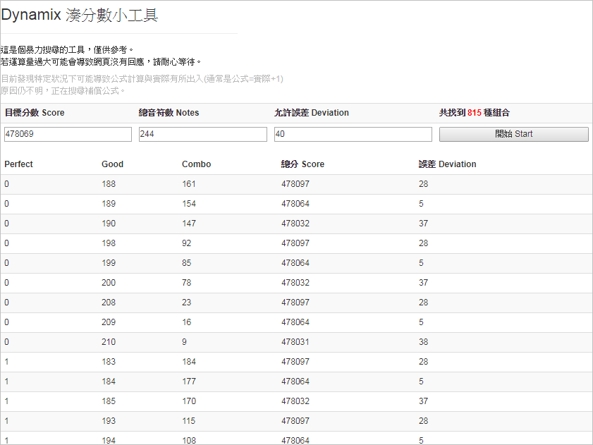
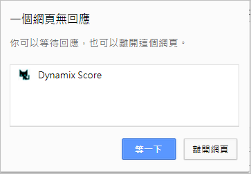

# dynamix score

https://liansheng197.github.io/dnx/

### 一個簡易的逆推分數的小工具。
* 三個用途：
	* 吃飽撐著地想要湊分數
	* 吃飽撐著地想要湊分數
	* 吃飽撐著地想要湊分數

#### 操作參考
|#|Description|Picture|
|----|----|----
|1|`D-Power=199999995` 因為是臨時起意的，湊不出整數，十分可惜。|
|2|實際操作畫面|
|3|然而使用時必須注意，過高的允許誤差可能導致網頁沒有回應，這點是因為太多筆符合資料以致網頁要一直變長...|
