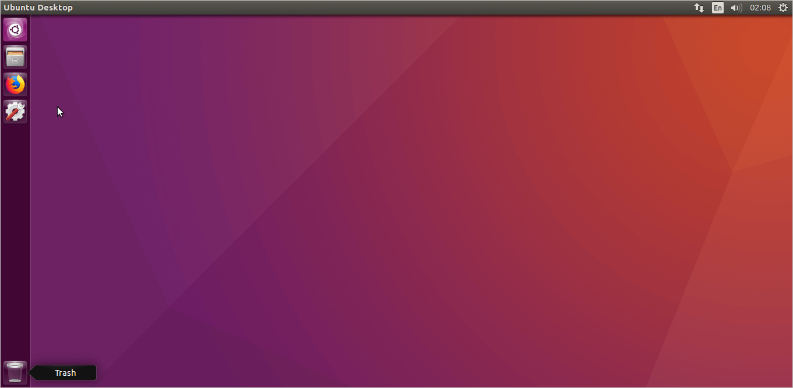

Kabuntu
===============
```
這只是用來... 喔不，這一點用都沒有。
介面效仿 Ubuntu 16.04 的預設桌面 (施工中)
```
### 命名
> Ka + Ubuntu

### 緣由
厭倦了熱門串底下的整排卡
不想要與其他人一樣，缺乏新意
於是想搞一個用來卡位卻又不失創意的靜態網頁
> `卡` 的拼音是 `ka`

### 為何選用 Ubuntu 16.04
這是我踏入 Linux 時使用的第一個發行版
我很喜歡它的設計

### 參考
|#|描述|附圖|
|----|----|----
|1|Ubuntu 16.04 的預設桌面|
|2|tty 的預設顯示<br>預計用來做成終端機的開場。||
|3|右上角的時間選單 (計畫)||